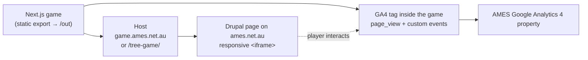

# Putting the Tree Game on the AMES Australia Website (Drupal) + Google Analytics

_A step-by-step plan for the team to publish **Power, Pressure & Choice** on
[ames.net.au](https://www.ames.net.au/) (a Drupal site) and track usage in Google
Analytics 4._

---

## Recommended approach (in one line)

**Build the Next.js game as static files → host it (a subdomain or a subfolder) →
embed it in a Drupal page with a responsive `<iframe>` → add a Google Analytics 4
tag _inside_ the game and send custom events.**



**Why an iframe (not a deeper Drupal integration):** the game is a self-contained
React/Next.js app that expects to own its whole page (its own canvas loop, audio,
`localStorage`, styling). An `<iframe>` keeps it **fully isolated** from the Drupal
theme — no CSS/JS conflicts, no hydration clashes, and it can be updated
independently of the website's release cycle. Re-implementing the game inside the
Drupal theme would be a large, fragile rewrite and is not recommended.

> **Important:** because it's an iframe, the website's existing GA/Tag Manager does
> **not** automatically see what happens inside the game. The game needs **its own**
> GA4 tag (Step 5).

---

## Step 1 — Prepare the game for static hosting

The game has no server-side code (no APIs, no server actions), so it can be exported
to plain static files that run anywhere.

1. **Enable static export** in `next.config.mjs`:
   ```js
   const nextConfig = {
     output: 'export',          // emit static HTML/CSS/JS to ./out
     trailingSlash: true,       // friendlier paths for static hosts
     images: { unoptimized: true },
     // basePath/assetPrefix: ONLY if hosting in a subfolder (see Step 2, Option B)
     // basePath: '/tree-game',
     // assetPrefix: '/tree-game/',
   };
   export default nextConfig;
   ```
2. **Simplify the `/game` route for export.** `app/game/page.js` uses a server
   `redirect()`, which static export doesn't support. Either delete that route (the
   game lives at `/`) or change it to a client-side redirect.
3. **Build:** `npm run build` → produces an **`out/`** folder of static files.
4. **Test locally:** serve the folder (e.g. `npx serve out`) and confirm the game
   works as static files — growth, decline, audio (on click), and progress saving
   (`localStorage`) all run client-side, so they work unchanged.

---

## Step 2 — Host the static build

Pick one. **Option A is recommended** for clean, independent deployment.

### Option A — A subdomain (recommended)
Host `out/` on a static host under a subdomain, e.g. **`game.ames.net.au`** (or
`play.ames.net.au`):
- Static hosts: **Vercel, Netlify, Cloudflare Pages**, or **AWS S3 + CloudFront**.
- Point the subdomain's DNS at the host; enable **HTTPS** (required — AMES is HTTPS).
- Gives you CDN delivery, easy redeploys/CI, and isolation from the Drupal release
  cycle.

### Option B — A subfolder on the existing site
Place the static build at **`https://www.ames.net.au/tree-game/`**:
- Set `basePath`/`assetPrefix` to `/tree-game` (Step 1) so asset URLs resolve.
- Work with the **Drupal hosting/devops team** to drop the files in a web-accessible
  path and **exclude that path from Drupal's router** (an `.htaccess` `RewriteCond`
  exclusion or a web-server alias) so Drupal doesn't try to handle it.
- Benefit: **same-origin** with the website (simpler security headers, Step 3).
- Watch-out: redeploys of Drupal must not wipe the folder.

Either way: confirm correct **MIME types**, **HTTPS**, and sensible **cache headers**.

---

## Step 3 — Allow the game to be embedded (security headers)

Browsers block framing unless both sides permit it.

- **On the game's host**, allow the AMES site to frame it — send
  `Content-Security-Policy: frame-ancestors https://www.ames.net.au;` and **do not**
  send `X-Frame-Options: DENY`. (On Vercel/Netlify/Cloudflare this is a headers
  config; on S3+CloudFront, a response-headers policy.)
- **On the Drupal site**, if a **Content-Security-Policy** is in force, add the
  game's origin to `frame-src` (and `child-src`), e.g.
  `frame-src https://game.ames.net.au;`. Many Drupal sites use the **Content
  Security Policy** module or set CSP at the web-server/CDN — check with devops.
- **Option B (subfolder)** is same-origin, so framing is allowed by default and these
  cross-origin rules don't apply.

---

## Step 4 — Embed it in a Drupal page

1. **Create the page.** Add a node (e.g. a *Basic page* or a dedicated landing page)
   where the game should live, or add it to an existing page via a **custom block**.
2. **Add a responsive iframe.** The game letterboxes a 16:9 (1600×900) scene, so wrap
   it in an aspect-ratio container so it scales on mobile:
   ```html
   <div style="position:relative;width:100%;max-width:1200px;margin:0 auto;
               aspect-ratio:16/9;">
     <iframe
       src="https://game.ames.net.au/"
       title="Power, Pressure & Choice — interactive tree"
       style="position:absolute;inset:0;width:100%;height:100%;border:0;"
       allow="autoplay; fullscreen"
       loading="lazy"></iframe>
   </div>
   ```
   - `allow="autoplay"` lets the in-game audio work; `title` is required for
     accessibility.
   - **Avoid `sandbox`** unless necessary — if you add it, it must include
     `allow-scripts allow-same-origin` or you'll break the canvas, audio and
     `localStorage`.
3. **Make Drupal accept the iframe.** Drupal's text filters strip `<iframe>` by
   default. Choose one:
   - Use a text format that **allows `<iframe>`** (e.g. *Full HTML* for trusted
     editors, or add `iframe` to the allowed tags of a restricted format), **or**
   - Use a small module/pattern: the **IFrame** field module, **Paragraphs**, or a
     **custom block + Twig template** holding the snippet above.
4. **Test** on desktop and mobile: scaling, the side panel vs. bottom-sheet layout,
   audio starting on first tap, and progress persisting.

---

## Step 5 — Google Analytics 4 (tracking + analytics)

Because the game runs in an iframe, add GA **inside the game** and report to the
**AMES GA4 property** (so the team sees it alongside the rest of the site's data).

### 5a. Get the GA4 details
- Use the existing **AMES GA4 property**; create a **new Data Stream** for the game
  (e.g. "Tree Game") to get a **Measurement ID** (`G-XXXXXXXXXX`).
- If AMES uses **Google Tag Manager**, you can instead add the **GTM container** to
  the game and manage tags there (note: the site's GTM does **not** run inside the
  iframe, so the game still needs its own container/tag).

### 5b. Add the GA4 tag to the game
In `app/layout.js`, load gtag with Next's `<Script>`:
```jsx
import Script from 'next/script';
// inside <body> (or <head>):
<Script src="https://www.googletagmanager.com/gtag/js?id=G-XXXXXXXXXX"
        strategy="afterInteractive" />
<Script id="ga4" strategy="afterInteractive">{`
  window.dataLayer = window.dataLayer || [];
  function gtag(){dataLayer.push(arguments);}
  gtag('js', new Date());
  gtag('config', 'G-XXXXXXXXXX');
`}</Script>
```

### 5c. Track the meaningful in-game events (the valuable part)
Page views alone won't tell the team much. Add a tiny helper and fire **custom
events** at the decision points so they can see how players move through the
branching, which endings they reach, and where they drop off.

```js
// lib/analytics.js
export function track(name, params) {
  if (typeof window !== 'undefined' && typeof window.gtag === 'function') {
    window.gtag('event', name, params || {});
  }
}
```
Wire it into `app/page.js` (the game already has the natural hooks):

| Event | Where to fire it | Useful parameters |
|---|---|---|
| `game_start` | when **Begin** is chosen | — |
| `choice_made` | in `choose()` for each pick | `step` (node id), `choice` (label), `kind` (healthy/harmful/neutral), `health` |
| `ending_reached` | when a node of type `ending` is reached | `ending` (id), `tone` (flourishing/recovering/withered), `health` |
| `commitment_written` | when the commitment is submitted | — |
| `game_restart` | on "Start over" / "Plant another" | — |
| `audio_toggled` | on the sound toggle | `muted` |
| `go_back` | on "Previous step" / the Withered "go back" | `from`, `to` |
| `step_view` _(recommended)_ | when each step/node is entered | `step` (node id), `phase` |

> **Data‑minimisation rule (required) — no free text ever leaves the game.** Every
> parameter in the table above is a **fixed value defined in the game's content or
> engine** — the node id, the developer‑authored choice **label**, the `kind`
> category (healthy/harmful/neutral) and the hidden `health` number. **None of them is
> anything the player typed.** In particular:
>
> - **`commitment_written` carries no content** — it reports only *that* a commitment
>   was written, never the words. The player's free‑text commitment (and any other
>   typed input) must **never** be added as an event parameter.
> - The `choice` value is the **predefined option label** from `lib/game-content.js`,
>   not user input. If you prefer to send even less, swap it for a short stable
>   `choice_id` plus `kind`.
> - Keep parameter values **short, non‑identifying and from this fixed list** — do not
>   add IP, name, email or any open‑text field.
>
> This keeps analytics aggregate and anonymous, as required for a violence‑prevention
> tool and the Australian Privacy Act. See
> [SECURITY_RISK_ASSESSMENT.md](./SECURITY_RISK_ASSESSMENT.md) (risk 8).

Example in `choose()`:
```js
import { track } from '@/lib/analytics';
// ...
if (cur.type === 'pick') track('choice_made',
  { step: cur.id, choice: option.label, kind: option.kind, health });
if (nextNode.type === 'ending') track('ending_reached',
  { ending: nextId, tone: nextNode.endingTone, health });
```
Mark `ending_reached` (and maybe `commitment_written`) as **Key Events** /
conversions in GA4 so completion rates show up in reports.

### 5d. What you can track in GA4

Putting it together, here is what the team can actually see and answer.

**Captured automatically (no extra work):** users (new vs returning), sessions,
**where players come from** (referrer / campaign — e.g. the AMES site vs social),
country / city, language, **device & browser**, desktop vs mobile, and average
**engagement time**.

**From the game's own events:**

| You can see… | From which event(s) |
|---|---|
| How many people actually **start** the game (vs. just load the page) | `game_start` |
| **Drop-off / funnel** — which step players leave at | `step_view` / `choice_made` (`step`) |
| **Which choices** are popular, and the **healthy-vs-harmful** split at each step | `choice_made` (`choice`, `kind`) |
| Which **branch** players take — healthy, harm, or harm-then-repair | `choice_made` (`kind`) + `go_back` |
| The **outcome mix** across the three endings | `ending_reached` (`tone`) |
| **Completion rate** and the **recovery rate** (made harm → owned it) | `ending_reached`, `commitment_written` |
| The **teachable moment** — reached Withered, then chose again | `ending_reached` + `go_back` |
| **Replay** — how many plant another tree | `game_restart` |
| **Sound** on/off preference | `audio_toggled` |

**Questions it answers:** How many play, from where, and on what device? How far do
they get, and where do they drop off? Which path and which ending is most common?
How many recover after harm? How many finish and write a commitment? How many replay?

**Where you view it in GA4:** **Realtime / DebugView** (to verify events fire), the
**Events** report, **Funnel exploration** (step-by-step drop-off), and **Path
exploration** (branches taken) — with `ending_reached` and `commitment_written` set
as **Key Events**. A **Looker Studio** dashboard can summarise it for the team.

> **Privacy:** keep analytics **aggregate and anonymous**, and **never send the
> player's written commitment** (or any free-text / sensitive input) to GA — track
> only that a commitment *was written*. This matters for a violence-prevention tool
> and for Australian Privacy Act compliance.

### 5e. Cross-domain & sessions
- On a **subdomain**, add `game.ames.net.au` and `www.ames.net.au` to the GA4
  data stream's configured domains so visits are stitched where possible. (True
  cross-document stitching through an iframe is limited; for most needs, having the
  game's events land in the AMES property is what matters.)
- If you only need the in-game funnel, a **separate GA4 property** for the game is
  also fine and keeps reporting clean.

### 5f. Privacy & consent (required)
GA4 sets cookies, so it must respect AMES's privacy obligations (Australian Privacy
Act / APPs) and any cookie-consent banner. These controls are also tracked as **risk 8**
in [SECURITY_RISK_ASSESSMENT.md](./SECURITY_RISK_ASSESSMENT.md):
- Implement **Google Consent Mode v2** in the game: default analytics consent to
  *denied*, and grant it only after the user accepts — **or** only inject the gtag
  script after consent.
- If AMES uses a consent tool (e.g. a Drupal cookie-consent module, Cookiebot,
  OneTrust), mirror that choice into the iframe (e.g. via the consent tool's API or a
  `postMessage` from the parent page).
- Confirm GA4 **IP/data settings** and update the site's **privacy policy** to mention
  the game's analytics.

### 5g. Verify
Use GA4 **DebugView** / **Realtime** to confirm `game_start`, `choice_made` and
`ending_reached` fire as you play through the embedded game.

---

## Step 6 — Test, launch, maintain

- **QA checklist:** desktop + mobile (iOS/Android), audio on first tap, progress
  saved across reload, iframe scaling, keyboard focus into the iframe, reduced-motion
  honoured, GA events visible in DebugView.
- **Go-live:** publish the Drupal page; add it to the relevant menu/navigation.
- **Updating the game later:** change the code → `npm run build` → redeploy the
  static files to the host. The Drupal page (just an iframe) needs no change unless
  the game's URL changes. With a subdomain host this can be a one-click / CI deploy.

---

## Who does what

| Task | Owner |
|---|---|
| Static export, GA tagging, redeploys | **Game / front-end developer** |
| DNS + static hosting (subdomain) or placing files in the Drupal docroot | **Hosting / DevOps** |
| Drupal page, iframe block, menu, text-format/CSP changes | **Drupal site admin** |
| GA4 property/stream, Key Events, consent, privacy policy | **Analytics / marketing owner** |

---

## Things to confirm with the AMES team

- The **GA4 Measurement ID** (or GTM container) to use.
- Whether the site already runs **Google Tag Manager** and a **cookie-consent** tool.
- Whether the Drupal site enforces a **Content-Security-Policy** (affects Step 3).
- Preferred **hosting** (subdomain vs subfolder) and who manages it.
- The **page/URL** on ames.net.au where the game should live.

_Reference: [ames.net.au](https://www.ames.net.au/) · pricing/figures elsewhere in
these docs are indicative — confirm current platform details before implementation._
