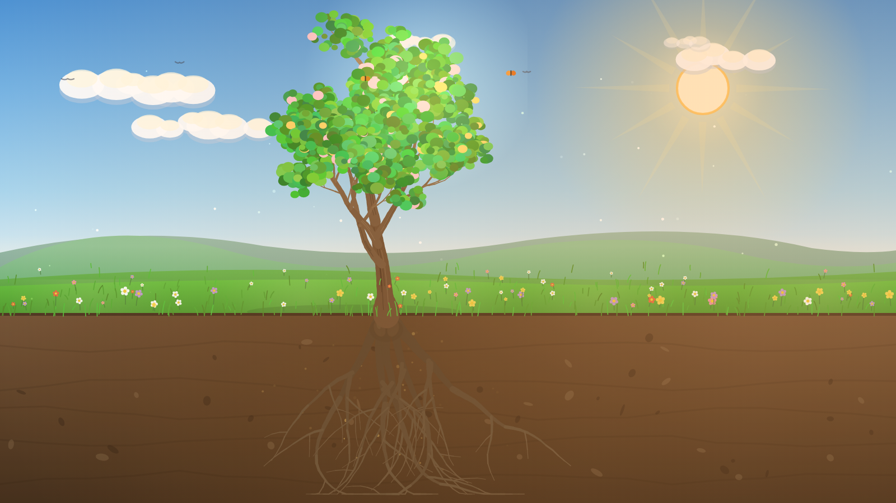
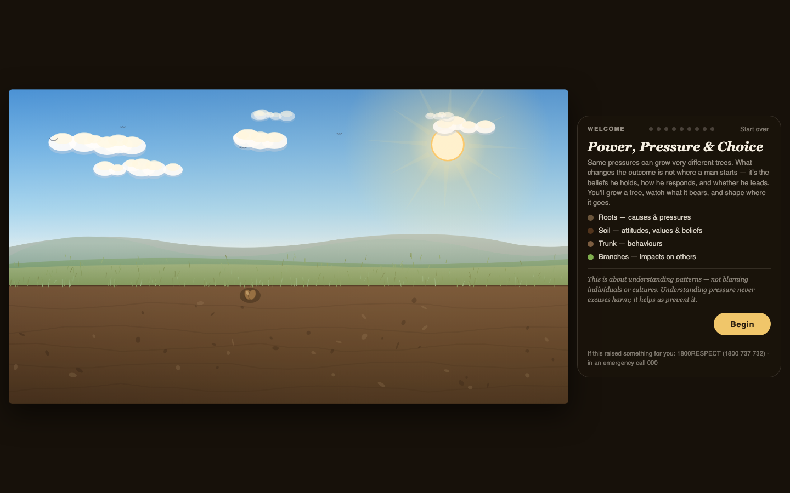
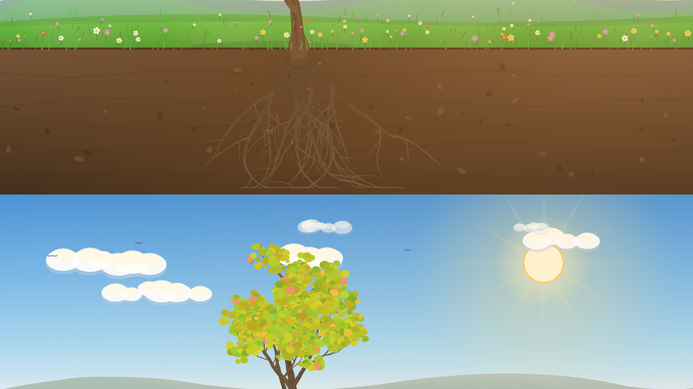
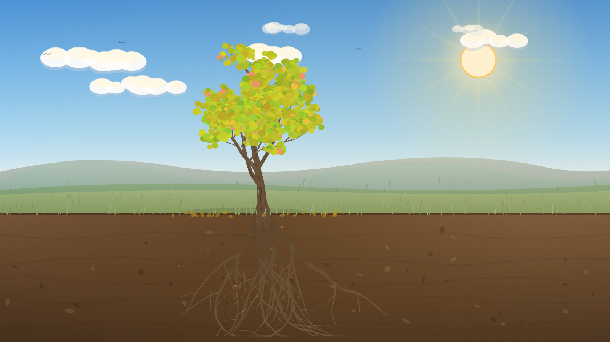
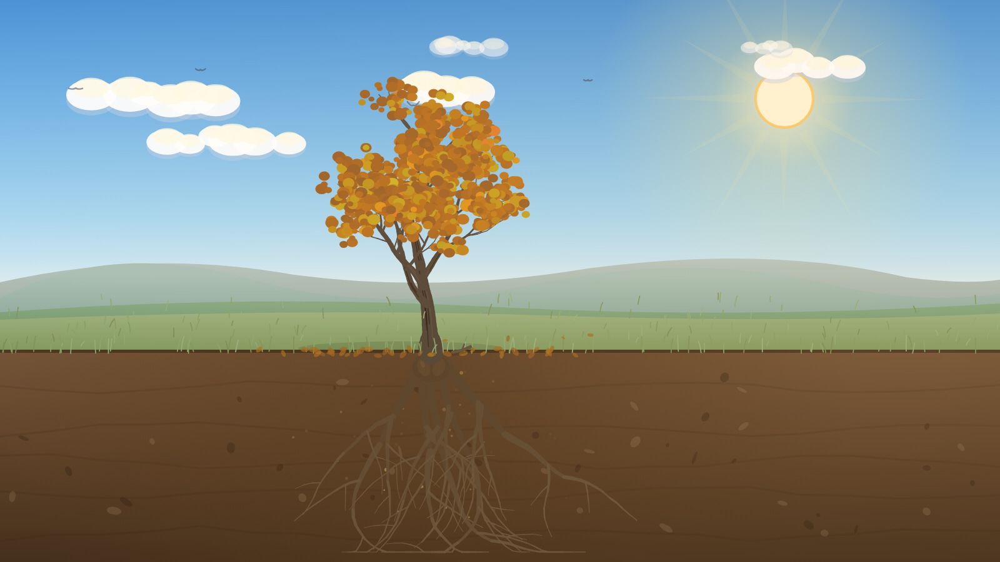
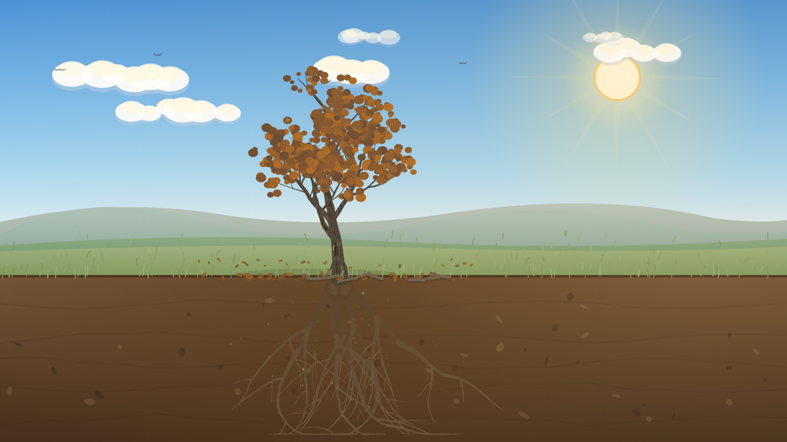
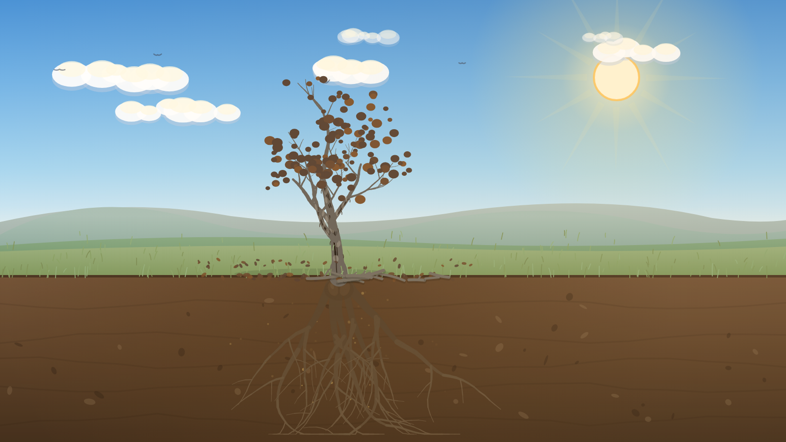
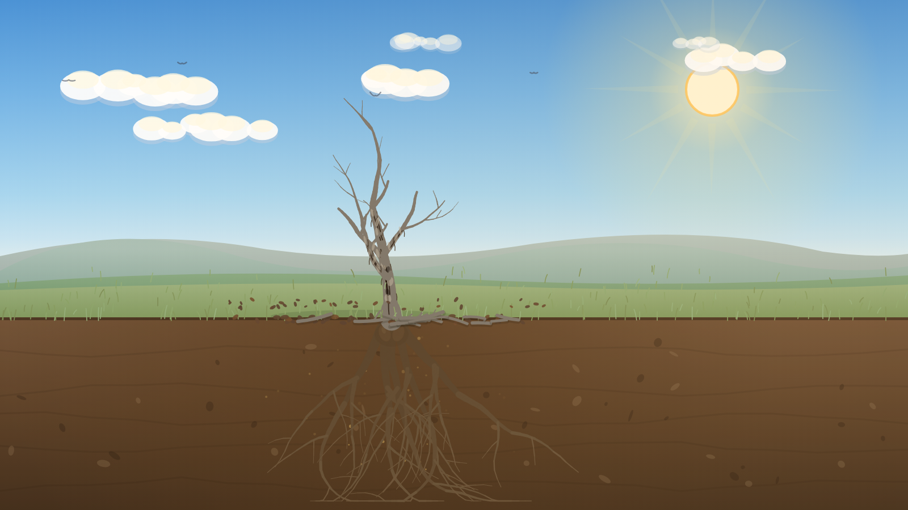
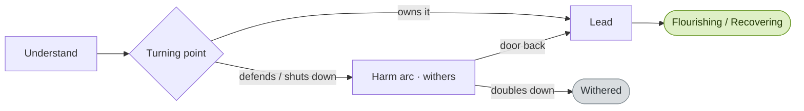

# Power, Pressure & Choice — Game Design Document

**Tagline:** _Same roots, different trees._
**Concept:** A short, reflective, branching web experience where a player grows a tree that mirrors how pressure becomes behaviour — and discovers that beliefs, responses, and leadership decide whether it withers or flourishes.
**Genre / format:** Narrative reflection game · single procedural canvas scene · ~3–6 minutes
**Platform:** Web (desktop + mobile), built in Next.js. Every leaf, root, hill and cloud is drawn live on a `<canvas>` — **no image assets**.
**Status:** Playable build. This document shows the team the current look & feel; screenshots below are real frames from the running game.

> **▶ Try it now:** open **[Power-Pressure-Choice-POC.html](./Power-Pressure-Choice-POC.html)** — a single self-contained file that plays the whole game in any browser (no install, works offline, runs on a phone). Hand-off notes are in [POC_README.md](./POC_README.md).

> Companion docs: the player flow is in [USER_JOURNEY.md](./USER_JOURNEY.md); the branch map is [journey-diagram.mmd](./journey-diagram.mmd) / [journey-diagram.png](./journey-diagram.png).

---

## 1. Vision

A man under real pressure is never reduced to a villain or a victim. The tree is a
calm, beautiful metaphor the player can *act on*: choices visibly grow it, harm it,
or heal it. The feeling we are designing for is **reflective, warm, and hopeful** —
the player should feel they are tending something alive, and leave with one real
commitment rather than shame.

### Design pillars

1. **The tree feels alive.** A sunlit, breathing landscape — drifting clouds, birds, wildflowers, a soft breeze — so growth and wither land emotionally, not just informationally.
2. **Choices are felt, not scored.** Consequences show on the tree (colour, falling leaves, light), never as a number or a "wrong" label.
3. **Hope is always reachable.** Every harm has a door back; the support line is always on screen; nothing dead-ends in blame.
4. **Calm, premium, restrained.** Golden-hour palette, serif reflection text, generous space. It should feel considered, not gamey.

---

## 2. Look & feel — art direction

The whole scene is procedural and golden-hour warm. The hero state is the fully
grown, flourishing tree:

### The living scene

Layered for depth (back to front): graded **sky** → hazy distant **mountains** →
soft **hills** → rolling **field band** → foreground **meadow** with grass and
**wildflowers**. Atmosphere and life on top: **sun** with glow and slow rays,
three-tone **clouds**, **birds** and a distant **flock**, **butterflies**, floating
sunlit **pollen motes**, and a gentle ambient **breeze** that sways the whole scene.
Below ground: a soil cross-section with strata, pebbles, and the tree's roots.

### Colour & light

A healthy scene is golden-hour warm. As a tree declines its leaves **change
colour** (green → yellow → brown) and then **fall**, the canopy thins to a bare
crown, the branches droop and the bark dies — while the wider landscape stays
alive, so the loss reads as *this tree*, not the world ending.

| Role | Reference |
|---|---|
| Sky gradient | `#4a92d6` → `#74b4e6` → `#a8d6ef` → `#edf3e6` (zenith → horizon) |
| Healthy foliage | living greens (HSL hue ~92→142), bright at golden hour |
| Dying canopy | leaves recolour green → yellow `~54°` → brown `~24°`, then fall to bare |
| Bark / wood | warm browns `#6b4c31` … `#937753`, darkening to dead grey-brown `#473f36`, then **peeling** to pale sapwood `#bcb19c` and weathering to silvery snag `#7c746a` |
| UI gold accent | `#f0c66a` |
| Panel / ink | translucent dark bar `rgba(26,19,11,0.85)` · text `#f5efe2` |

### Typography & UI

- **Reflective voice** (titles, questions, insights): Georgia **serif italic** — feels human and considered.
- **Interface** (labels, buttons, legend): Helvetica/Arial **sans** — clean and quiet.
- **Accent:** a single warm **gold** for the primary action and highlights.

The UI is one floating **panel** (a right-hand column on desktop, a bottom sheet on
mobile) over the full-bleed scene. Choices are rounded **pills**; the selected one
fills gold. A nine-step **progress** indicator, a phase tag, the question, a hint,
and — after choosing — a reflective insight line. The **1800RESPECT / 000 support
line** sits in the panel footer on **every** screen.

### Motion & feel

- **Growth** eases in over ~1–2s as the player advances (the tree literally grows on each choice). The **roots spread gradually** alongside the trunk, young **leaves appear while the sapling is still rising**, and the crown scales up from seedling to mature — auto-fitted so the full-grown tree always sits inside the frame.
- **Watering** accompanies growth: on each growth step a pair of small **ground sprinklers** rise by the base and throw arcs of water in toward the trunk, with splashes and the **soil darkening** where it lands — so growth reads as *tended*, not magical.
- **Decline** is a gradual, natural die-back tied to a hidden **health** value (100→0): leaves **change colour** (yellow then brown), the canopy **thins and sheds**, branches **droop and sag**, bark **darkens, cracks and peels** (pale dead wood showing through), and outer **branches snap off**, with the sway slowing to complete stillness when dead — sober and lifelike, never flashy. Shed **leaves and broken branches collect on the ground** beneath the tree. As a clear escalating cue, the **first** wrong choice recolours the leaves and the **second** makes them start to fall.
- **Healing** rewards: green returns, a brief gold **heal shimmer** rises through the canopy, butterflies and flowers come back — and the flourish builds **one leadership step at a time** (warmth and first flowers → golden colour and butterflies → full golden light).
- **Breeze** is a subtle, self-driving ambient sway across leaves, grass, flowers, clouds and motes — and it fades out as the tree loses vitality.

---

## 3. The tree as a system

The metaphor is the mechanic. Each layer of the tree maps to a layer of the model:

| Tree | Meaning |
|---|---|
| **Roots** | Causes & pressures (migration stress, money, racism, isolation) |
| **Soil** | Attitudes, values & beliefs |
| **Trunk** | Behaviours |
| **Branches** | Impacts on others (partner, children, community) |
| **Vitality (health 100→0)** | The tree's living condition — restored by leadership, drained by harm. Drives the staged die-back in §4. |

### Growth progression (a healthy run)

| The beginning | Taking shape | Flourishing |
|---|---|---|
|  |  |  |
| Seed in a living landscape | A young sapling — already leafing out as it rises | Full-grown, golden hour |

---

## 4. The natural die-back (the heart of it)

Harm no longer just "pales" the tree — it drives a continuous, lifelike **death
process** keyed to the hidden health value. As the player makes harmful choices the
tree moves down these six stages in real time (and healthy choices move it back up).
This is the single most important thing to show the team.

| Health | Stage | The tree |
|---|---|---|
| **100–80%** · Healthy |  | Full green canopy, vibrant, upright |
| **79–60%** · Early stress |  | Leaves yellowing, canopy starting to thin, sway softens |
| **59–40%** · Decline |  | Yellow/amber leaves, leaves falling and gathering on the ground, thinning canopy, branches begin to droop |
| **39–15%** · Severe damage |  | Brown, sparse leaves, many fallen, branches sag, bark darkening, cracking and starting to peel |
| **14–1%** · Near death |  | Almost bare, a few last brown leaves, branches sag heavily and some **snap off**, trunk dark with peeling bark, broken branches and leaves littering the base |
| **0%** · Dead |  | Bare grey-brown snag — bark peeled, **outer branches broken off**, fallen leaves and branches littering the ground, no animation or life |

The meadow's flowers, butterflies and motes recede as the tree dies, while the
hills and sky stay alive — the loss is focused on the tree. The decline is
deliberately **quiet, not punishing**: a warning, not a "game over", and at the
turning point it is always reversible.

---

## 5. Gameplay, in brief

The player grows the tree through four **understanding** steps (roots → soil → trunk
→ impact), reaches a **turning point**, then either leads it back to health
(self → family → community) or walks a harm arc that always offers an accountability
door. A run ends in one of three states. Full detail and the branch map are in the
[user journey doc](./USER_JOURNEY.md).

### The three endings

| Ending | Look | Tone |
|---|---|---|
| **Flourishing** | Full colour, golden light, butterflies (health 100) | Earned, warm: "Not by chance — by choice." |
| **Recovering** | Partly recovered green, some brown/bare twigs remain (health ~60) | The most admirable: change after harm is strength |
| **Withered** | A full-grown but **dead** tree — bare grey-brown, drooping, still (health 0) | Sober warning, always reversible; support line foregrounded |

Each ending recaps the player's **actual path** and the commitment they wrote, so
replaying with different choices genuinely tells a different story.

---

## 6. Audio (implemented)

Synthesised live in the browser — **no audio files**, matching the asset-free
approach of the visuals. A low ambient **bed** (gentle wind + occasional distant
birds + a soft warm pad) fades in when the player begins, with soft, non-gamified
**cues** layered on top: a warm chord **swell** on healing / leadership choices,
and a **hush + a single low note** on harm. Endings get a fuller resolve
(flourishing / recovering) or a low, somber note (withered). A **sound toggle** in
the panel mutes/unmutes and the choice is remembered. No stings, no "fail" buzzer.
Audio starts on the first interaction (browser autoplay policy) and honours the
mute preference.

---

## 7. Technical snapshot

- **Stack:** Next.js (React) + a single framework-free canvas engine (`lib/tree-engine.js`).
- **All visuals are generated** — procedural tree, scenery, particles. No image/sprite assets to manage, fully resolution-independent, tiny footprint.
- **Audio is generated too** — `lib/audio-engine.js` synthesises the ambient bed and cues via the Web Audio API; no audio files, with a remembered mute toggle.
- **Content as data:** the whole branching script lives in `lib/game-content.js` as an editable node graph — writers can change copy and branches without touching rendering.
- **Persistence:** progress, path, and commitment auto-save to `localStorage`.
- **Health-driven rendering:** a single `setHealth(0–100)` value drives the whole die-back (leaf colour, canopy thinning, branch droop, bark darkening/cracking/peeling, branches breaking off, leaf-and-branch litter on the ground, animation), so designers can tune the death curve in one place.
- **Auto-fit crown:** the mature tree is measured per shape and scaled so the full crown always fits the canvas — no clipping off the top, even when a new random tree is generated.
- **Accessibility:** decline is conveyed by colour **and** canopy thinning **and** droop **and** text (not colour alone); the leaf-fall and branch-fall bursts soften under `prefers-reduced-motion`.

---

## 8. Tone & guardrails (non-negotiable)

This is a violence-prevention tool. The look & feel serves it: consequences attach
to the depicted **choice**, never the player's worth. Pressures are never a "wrong
answer", naming a victim is never a failure, help-seeking always heals, and support
is always one glance away. (Full list in `lib/game-content.js` and the user journey doc.)

---

## 9. Visual reference index

| File | What it shows |
|---|---|
| `images/ui-intro.png` | The game UI: scene + reflection panel + legend + support line |
| `images/scene-seed.png` | Opening state — the living landscape before growth |
| `images/scene-growing.png` | Mid-growth — trunk and canopy forming |
| `images/scene-flourishing.png` | Hero — full colour, golden hour, wildflowers |
| `images/health-100.png` … `health-0.png` | The six-stage die-back (healthy → dead), §4 |

_All frames are real output from the current build (1600×900 canvas)._
