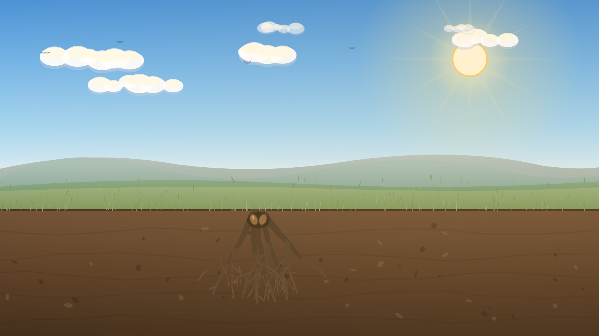
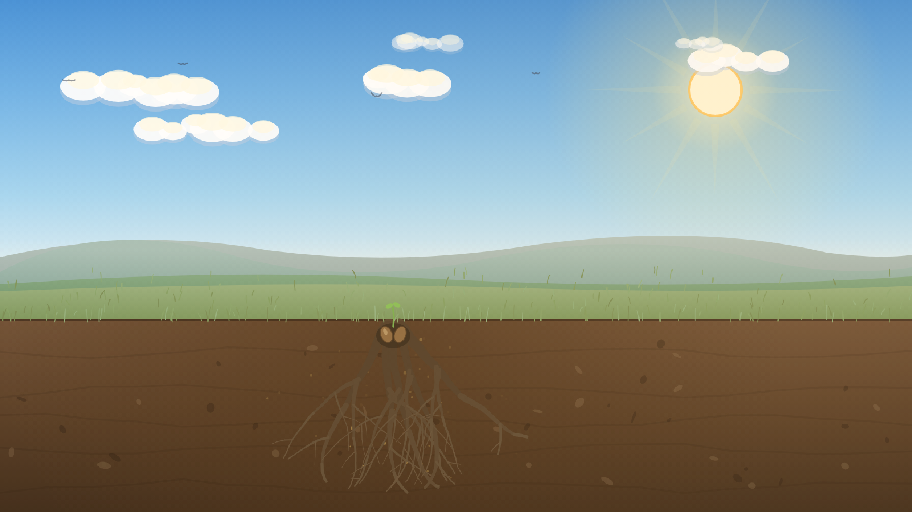
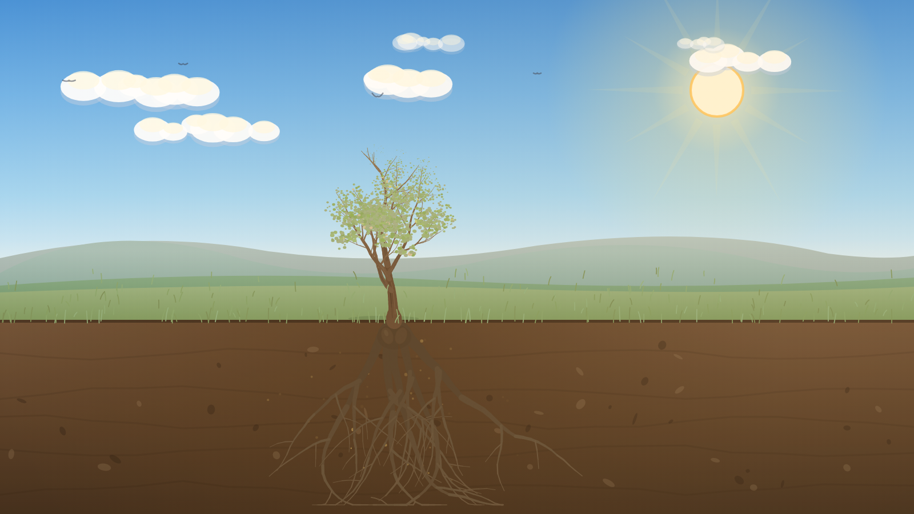
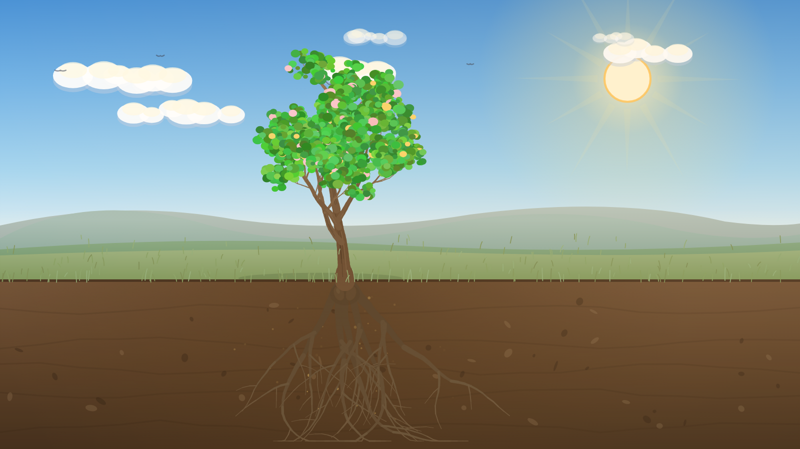

# How the Tree Grows and Dies — the Answer Flows

_A simple walk-through for the team: how the tree **grows** when the player makes
healthy, leadership choices — and how it **dies** when the choices are harmful._

The game is built on one idea: **the same pressure can grow very different trees —
what changes the outcome is the man's beliefs, his response, and whether he leads.**
This document follows both paths so you can see the contrast: **Part 1** is the
healthy path that grows the tree to full bloom; **Part 2** is the harmful path that
makes it decline and die.

> A note on "correct": the first steps (Roots and Branches) are about
> **understanding**, not scoring — there's no wrong pressure to be under, and naming
> who is affected is never a failure. The tree's growth or decline comes from the
> **choices** the man makes (belief → response → turning point → Self / Family /
> Community).

**Grounded in a real tree's life cycle.** The growth and decline are modelled on the
natural [life cycle of a tree](https://ecotree.green/en/blog/the-life-cycle-of-a-tree):
healthy choices carry it through **Seed → Germination → Sapling → Mature tree**, and
harmful choices push a mature tree through the natural **dying process — ageing →
decline (dieback) → a decaying, dead "snag" (deadwood)**.

| | Life-cycle stages it moves through |
|---|---|
| **Growth (correct answers)** | Seed → Germination (seedling) → Sapling → **Mature tree** (fruit & flowers) |
| **Decline (incorrect answers)** | Mature tree → Ageing → Decline (dieback) → **Decaying tree / snag** (dead) |

---

## The tree is the model

| Part of the tree | What it represents |
|---|---|
| **Roots** | Causes & pressures (migration stress, money, racism, isolation) |
| **Soil** | Attitudes, values & beliefs |
| **Trunk** | Behaviours |
| **Branches** | Impacts on others (partner, children, community) |
| **Colour & leaves** | Vitality — the tree greens and blooms, or yellows, sheds and dies |

---

## Part 1 — The growth path (healthy choices)

Each healthy choice grows the tree one step further. Together, the steps carry it
through a real tree's life cycle — **seed → germination → sapling → mature tree**.

As it grows, three things keep the growth feeling alive and tended: the **roots
spread gradually** alongside the trunk (they keep reaching deeper as the tree gets
taller, instead of appearing all at once); young **leaves appear while the sapling is
still rising**, so it is never a bare stick; and on **every growth step a pair of
small ground sprinklers water the tree** — arcs of water play over the base and the
soil darkens where it lands.

| Step | The question the player faces | The healthy choice | The tree grows… |
|---|---|---|---|
| **1. Roots** | _Choose a pressure this man is carrying_ | Name any pressure (all valid — understanding, not blame) | **Roots spread** underground — the tree takes hold (and keep reaching deeper as it grows) |
| **2. Soil** | _What belief is feeding the soil?_ | **"I can share the load — honesty protects my family more than image"** | The **soil enriches** and a first sprout appears |
| **3. Trunk** | _The pressure is rising — how does he respond?_ | **"Notice the pressure rising — and pause before acting"** | The **trunk rises** and its first young **leaves** show as it grows taller |
| **4. Branches** | _Behaviours bear fruit — who feels it?_ | Name an impact honestly (the first act of leadership) | **Branches fill out** and the canopy **leafs out** full green |
| **5. Turning point** | _The impact is visible — what does he do with that?_ | **"Own it — this is on me to change"** | **Colour begins to return** to the canopy (the bloom then builds over the next steps) |
| **6. Self** | _What does he do for himself?_ | **"Acknowledge the stress and seek support"** | The canopy **warms** and the first **wildflowers** open, with a soft heal-glow |
| **7. Family & peers** | _What does he do at home and with his mates?_ | **"Share decision-making and money openly at home"** | The canopy turns **golden** and **butterflies** return to a meadow full of flowers |
| **8. Community** | _What does he lead beyond his own home?_ | **"Normalise help-seeking among the men around him"** | **Golden light** floods the scene and the tree reaches **full bloom** |
| **9. Commitment** | _Write one action you will take as a leader_ | The player writes their own real commitment | The tree stands in **full bloom** |

The result is the **Flourishing** ending — a full-colour, golden-hour tree.

> **The flourish is earned one step at a time.** The leadership steps each land as
> their own visible change rather than all at once: **Self** warms the canopy and
> brings the first flowers, **Family** turns it golden with butterflies returning, and
> **Community** brings the golden light and full bloom. (Because owning it grows the
> tree from a green young tree up to maturity, each leadership choice adds a distinct
> layer of colour, flowers and light.)

### The growth ladder, in pictures

Mapped to a real tree's life cycle (the game step is shown in brackets).

| Life-cycle stage | The tree | What's happening |
|---|---|---|
| **Seed** |  | A seed in the soil — the starting point _(start)_ |
| **Germination** |  | Roots and a first shoot emerge _(Roots — causes & pressures)_ |
| **Seedling** |  | The sprout establishes, the soil enriches, the roots keep spreading _(Soil — beliefs)_ |
| **Sapling** |  | A young sapling — the trunk rises already carrying its first young leaves _(Trunk — behaviour)_ |
| **Young tree** |  | The canopy fills out full green _(Branches — impacts)_ |
| **Mature tree** |  | Full height, bearing fruit & flowers in golden light _(Leadership)_ |

**In one line:** _Pressure → a healthier belief → a paused response → owning the
impact → leading at every level → a tree in full bloom._

---

## Part 2 — The decline path (harmful choices)

Harmful choices do the reverse: each one drains the tree's hidden **health**, and
the tree visibly declines — following the natural way a tree dies: the tree it had
grown into **ages**, its canopy goes into **decline (dieback)**, and it ends as a
**decaying, standing dead "snag" (deadwood)**. The leaf feedback is deliberately
**staged** so the player feels the consequence build:

- **First wrong answer → the leaves change colour** (they start to yellow).
- **Second wrong answer → the leaves begin to fall** — and shed leaves start to
  **collect on the ground** beneath the canopy.
- **Keep going →** the canopy thins to bare, branches droop, the **bark darkens,
  cracks and peels** (pale dead wood showing through), outer **branches snap off** and
  **broken branches fall to the ground**, the movement stills, and the tree dies —
  ending as a bare snag with a litter of fallen leaves and branches at its base.

> **The tree declines in place — it never grows on a wrong answer.** Past the
> turning point, harmful choices only **age and drain** the tree; they never make it
> bigger. It sheds, droops and decays at the **same size it had reached**, finishing
> as a bare snag of that exact height. Only leadership ever grows the tree — so the
> dead snag is visibly the *young, unfinished* tree the harm cut down, never a taller
> one. (The build steps — Roots → Branches — are the only place the tree gains size,
> because the structure has to exist before there is anything to harm.)

### The decline, step by step

| Step | The harmful choice | The tree… |
|---|---|---|
| **Soil** | **"I must stay in control"** | Health drops — the **leaves change colour** (first yellowing) |
| **Trunk** | **"Tighten control over the money"** | Health drops again — the **leaves begin to fall** |
| **Branches** | _(naming who is harmed — no penalty)_ | The canopy keeps thinning; branches start to **droop** |
| **Turning point** | **"Defend it"** or **"Shut down"** | The tree is **failing** — colour drains, more leaves fall, branches droop, bark darkens (declining, not yet bare) |
| **The door is still open** | **"Keep insisting he's the one being wronged"** | Only now does it reach **bare and dead** — the Withered ending, at the size it had reached |

At the **Turning point** and **the door**, the opposite choice — _owning it and
being accountable_ — reverses the decline and the tree begins to recover. The
withered ending is **always reversible**: it offers "go back and choose again", and
the support line (1800RESPECT / 000) is on every screen.

_(The Self / Family / Community leadership steps work the same way — a harmful
option there ("push through alone", "quietly control the money", "keep it private")
leaves that part of the canopy pale and sheds a few more leaves.)_

### The dying stages, in pictures

How the tree ages and dies as its health falls from 100% to 0% — mapped to the
natural dying process (the article calls the dead end-state a "decaying tree" or
**snag**).

| Health | Life-cycle stage (dying) | The tree |
|---|---|---|
| **100–80%** · Mature & healthy |  | Full green canopy, vibrant, upright |
| **79–60%** · Ageing / early stress |  | Leaves yellowing, canopy starting to thin |
| **59–40%** · Decline (dieback begins) |  | Yellow/amber leaves, leaves falling and gathering on the ground, branches begin to droop |
| **39–15%** · Severe dieback |  | Brown, sparse leaves, many fallen, bark darkening, cracking and starting to peel |
| **14–1%** · Near death |  | Almost bare, branches sag and some snap off, bark peeling, broken branches and leaves litter the base |
| **0%** · Decaying snag (dead) |  | Bare grey-brown deadwood — peeled bark, branches broken off, fallen leaves and branches littering the ground |

**In one line:** _A hardening belief → controlling behaviour → defending it →
refusing to own it → a bare, dead tree_ — but at every step a different,
accountable choice brings the tree back. Understanding the pressure never excuses
the harm; it helps prevent it.

---

_The full branching map and all endings are in the
[Game Design Document](./GAME_DESIGN_DOCUMENT.md) and the
[User Journey](./USER_JOURNEY.md)._

_Life-cycle stages are based on EcoTree, ["The life cycle of a
tree"](https://ecotree.green/en/blog/the-life-cycle-of-a-tree) (Seed → Germination →
Sapling → Mature tree; and the decaying tree / "snag")._
