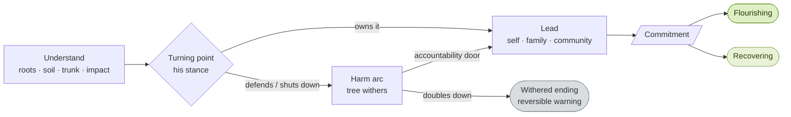
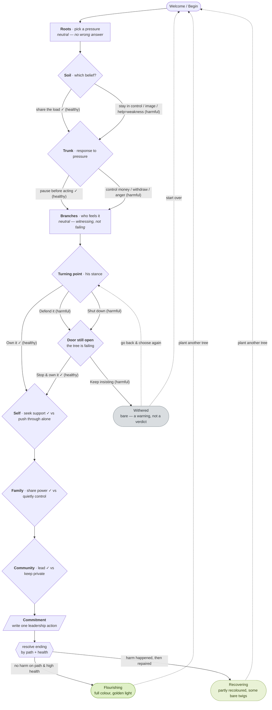
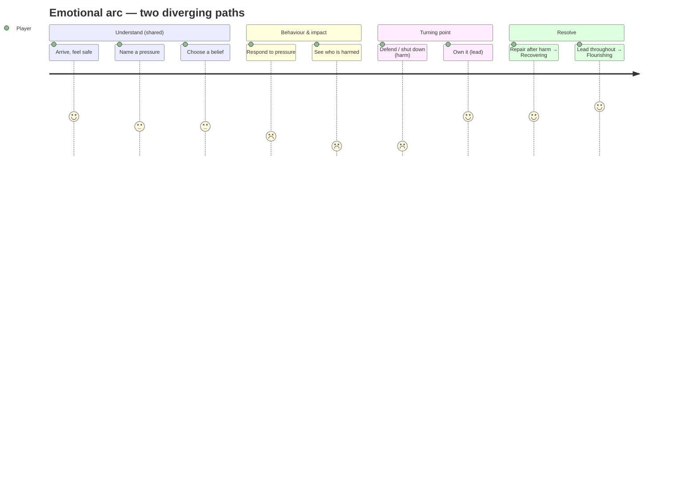

# Power, Pressure & Choice — User Journey

_Branching Edition: "Same Roots, Different Trees"_

This document describes the player's journey through the game: who they are, what
they see and do at each step, how the tree and landscape respond, the emotional
arc, the branch points, and the three possible endings. Diagrams are written in
[Mermaid](https://mermaid.js.org/) and render in VS Code's Markdown preview and on
GitHub. The raw branch diagram is also in [`journey-diagram.mmd`](./journey-diagram.mmd).

> The game is a violence-prevention education tool. Causes are never the player's
> fault, naming a victim is never a "failure", help-seeking always heals, and the
> support line shows on every screen. These guardrails shape the whole journey —
> see [Safety & pedagogy](#safety--pedagogy) and `lib/game-content.js`.

---

## 1. Who the journey is for

| | |
|---|---|
| **Primary player** | A man in the "Power, Pressure & Choice" program, positioned as a *leader of positive change* — often exploring this in a migrant-community context. |
| **Facilitator** | A program educator using the tree as a shared visual to spark reflection and discussion in a session. |
| **Context of use** | Single-page web experience on a phone (bottom-sheet panel) or laptop (side panel). One sitting, ~3–6 minutes. Progress auto-saves to `localStorage`, so a session can be paused and resumed. |
| **What success looks like** | The player connects pressure → belief → behaviour → impact, *feels* that the same pressure can grow different trees, and leaves with one concrete leadership commitment — not shame. |

---

## 2. The journey at a glance

The player grows a tree through four "understanding" steps, reaches a **turning
point**, then either leads it back to health or walks a harm arc that always offers
a door back. Choices genuinely diverge, and the run ends in one of three states.

---

## 3. Full branch map

Every node and where each option leads. Solid arrows are the main flow; dotted
arrows are "play again / go back" navigation. `✓` marks the healthy choice at a
fork; the diamond forks are where the journey can genuinely diverge.

---

## 4. Stage-by-stage journey

How each step feels from the player's side, and how the scene answers back. The
tree grows one stage behind the label (each choice grows the tree as you move on),
and a hidden `health` value (starts 100) quietly tracks the path. As the tree grows,
its **roots spread gradually** with it, young **leaves appear while the sapling
rises**, and a pair of small **ground sprinklers water it on each growth step**.

| Phase | What the player sees / does | How the tree & landscape respond | Emotional beat | Learning intent |
|---|---|---|---|---|
| **Welcome** | Title, the metaphor legend, a non-blaming framing line. Taps **Begin**. | A bare seed in a sunny, living landscape (drifting clouds, birds, wildflowers, soft breeze). | Curiosity, safety | "This is about patterns, not blame." |
| **Roots** · pressures | Picks one pressure the man carries (migration stress, money, racism, isolation). | Roots spread underground. Scene unchanged — **no penalty**. | Recognition / empathy | Pressures are weight he's *under*, never his fault. |
| **Soil** · beliefs | First real choice: a hardening belief ("I must stay in control") **or** a healthier reframe ("I can share the load"). | Healthy → soil glows warm. Harmful → soil dims, colours cool (`dull` palette). | First tension | The belief filter decides what the same pressure grows. |
| **Trunk** · behaviour | Chooses how he responds: act on the pressure (control / withdraw / anger) **or** pause before acting. | Healthy → trunk grows green. Harmful → canopy thins, **a few leaves fall**, scene greys. | Dawning consequence | Behaviour is a choice; harm can be interrupted before it lands. |
| **Branches** · impact | Names who feels it (partner, children, community). | Canopy reflects whatever the trunk choice set — **naming is never penalised**. | Sobering | "Where harm becomes real — and where responsibility begins." |
| **Turning point** · stance | The pivot. **Own it**, **Defend it**, or **Shut down**. | Own it → colour begins to return. Defend / shut down → **leaves fall and gather on the ground, colour drains, bark darkens, the tree fails**. | The hinge | His response to visible harm decides which tree grows. |
| **Door still open** (harm only) | The tree is failing (declining, not yet bare). **Stop & own it** or **keep insisting he's wronged**. | Stop & own → strong heal from a failing state. Keep insisting → the Withered ending (only here does it go bare — branches break off, bark peels, litter on the ground). | Last-chance gravity | A failing tree is a warning, not a verdict — change after harm is the point. |
| **Self / Family / Community** | Three leadership steps. Each: lead (seek support, share power, lead others) **or** avoid (push through, quietly control, keep private). | Each healthy pick advances the bloom a **distinct step** (Self → warmth & first flowers, Family → golden canopy & butterflies, Community → golden light & full bloom) with a gold **heal shimmer**. Each avoidant pick leaves that part pale and sheds a leaf. | Building agency | Healing is active and chosen; help-seeking is always the stronger move. |
| **Commitment** | Writes one real leadership action (or taps a suggestion chip). | Tree at full stage; canopy and meadow at their richest on a healthy path. | Ownership | Small, real, and *yours* — that's leadership. |
| **Ending** | One of three reflective screens with a path recap, the four key messages, and the support line. | The scene settles into Flourishing, Recovering, or Withered (see §6). | Resolution / reflection | The contrast between endings teaches what changes the outcome. |

---

## 5. The three paths, walked

### 5a. Flourishing — leadership throughout
`Begin → pressure → "share the load" → "pause before acting" → name the impact → **Own it** → seek support → share power → lead the community → commit`

Health climbs the whole way and never dips; no harmful choice is made. The tree
grows green and finishes in full golden-hour colour with butterflies. Tone:
*earned, warm, grounded* — "Not by chance — by choice."

### 5b. Recovering — harm, then accountability (the most admirable ending)
`… a hardening belief → tighten control over money → partner feels unsafe → **Defend it** (tree withers, leaves fall) → **Stop & own it** (tree begins to recover) → strong leadership → commit`

The player *feels* the tree wither, then leads it back. The ending is partly
recoloured with a few bare twigs that remain — harm leaves a trace, and owning it
is framed as strength, not a second-best run.

### 5c. Withered — doubling down (always reversible)
`… → **Shut down** → at the door, **keep insisting he's wronged** → Withered ending`

The only route to the bare tree, and only by repeatedly refusing accountability.
The screen is sober (never "you lose"), names that a different choice at any fork
led elsewhere, foregrounds the support line, and always offers **"Go back and
choose again"** (returns to the turning point) and **"Start over"**.

---

## 6. Endings & re-engagement

| Ending | Reached when | Scene state | Re-engagement |
|---|---|---|---|
| **Flourishing** | No harmful choice on the path **and** health ≥ 70 | Full colour, golden light, full canopy, butterflies | "Plant another tree" → restart |
| **Recovering** | Harm happened but the accountability door was taken | Partly recoloured; a few bare twigs persist | "Plant another tree" → restart |
| **Withered** | Only via "keep insisting" at the door (repeated doubling-down) | Bare grey-brown snag — peeled bark, branches broken off, fallen leaves and branches littering the ground; support line prominent | "Go back and choose again" → turning point · "Start over" |

Every ending shows the player's **actual path recap**, the commitment they wrote,
and the four key messages — so replaying with different choices genuinely tells a
different story, which is the core of the experience.

---

## 7. Decision points & consequences (quick reference)

| Step | Healthy choice → | Harmful choice → |
|---|---|---|
| Soil | warm soil, health ↑ | cooled/`dull` soil, health ↓ |
| Trunk | green trunk, health ↑ | thinning canopy, leaves fall, greying, health ↓ |
| Turning point | colour returns, → leadership | wither deepens, → the door |
| Door (harm) | strong recovery, → leadership | → Withered ending |
| Self / Family / Community | that third regreens + shimmer | that third stays pale + a leaf falls |

Options are **never pre-labelled** right/wrong — the consequence is only revealed in
the reflective insight line *after* the player chooses, so harmful options read as
recognisable real choices, not labelled traps.

---

## 8. Touchpoints & states

- **Surface:** one canvas scene + one panel (side column on desktop, bottom sheet on mobile).
- **Persistence:** node id, path log, commitment, and visual state save to `localStorage`; refresh resumes mid-journey.
- **Progress:** a fixed nine-phase dot indicator stays stable across branches (the harm arc visits the turning point twice but maps onto the same backbone).
- **Always present:** the 1800RESPECT / 000 support line is a persistent panel footer on *every* screen.

---

## 9. Safety & pedagogy

These are invariants of the journey, not styling — keep them on any future edit
(also documented in `lib/game-content.js`):

- **Roots and impact never have a wrong answer.** A man is not at fault for the pressures he's under, and naming a victim is framed as the first act of leadership, never a failure state.
- **Harmful behaviour never heals the tree;** help-seeking is always the stronger, healing fork.
- **No ending is determined by the pressure.** The Withered ending is reachable only by repeatedly doubling down, and always offers a route back.
- **The support line is never gated** behind a "good" path.
- **No shame language** ("you failed / you killed the tree") — consequences attach to the depicted choice, in a reflective register.
- **Accessibility:** wither is carried by greying *and* canopy thinning *and* the insight text (not colour alone); the leaf-fall burst is softened under `prefers-reduced-motion`.
